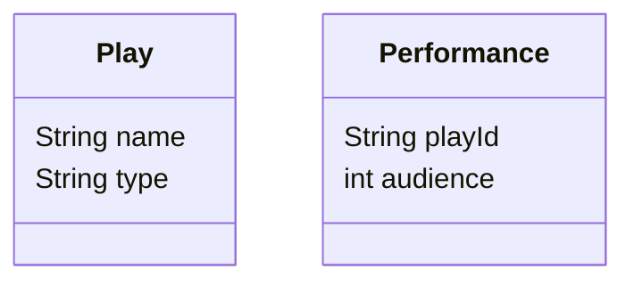
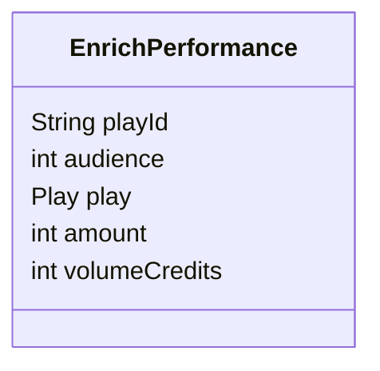

# CHAPTER01 리팩터링: 첫 번째 예시

## 주요 기능
장르와 관객 수에 따라 공연료와 포인트를 계산

---

## 진행 사항

- [x] 원하는 언어를 이용해 예제를 따라함
- [x] 느낀 점, 생각을 넣음

---


## 느낀점
0. '언제, 어떻게 리팩터링을 해야하는가?' 라는 질문에 스스로 답을 해보았다.
테스트 하기 힘든 코드를 만났을 때 리팩터링을 하였다.
그런데 리팩터링을 어떻게 해야하지? 라는 기준이 없었던거 같다.
좋은 말로는 감각적으로, 나쁜 말로는 막연하게 했던거 같다.
아직 chapter01 만 읽어 보았지만 앞으로의 chapter들에서 많은 인사이트를 얻을 수 있을거라 기대해본다.

1. 책과 상관 없는 이야기로는 예제와 다른 언어로 예제를 따라 해보는 것은 생각 보다 **어렵다**는 것을 알게 되었다.
A, B, C 라는 언어를 잘 알고 있다고 생각 했고, 실제로 잘 사용하고 있다.
그런데 'A 언어로 된 코드를 B 언어로 바꾸시오' 라는 리퀘스트가 왔을 때, 결과적으로 동일한 기능이 되게 하는 것은 쉬우나
비슷한 형태로 하는 것은 어려울 수 있다는 것을 알게 되었다.

---

## 알게 된 점
서로 연관이 있는 class와 변수를 하나의 class로 합치는(enrich) 과정이 좋았다.

chapter01의 주요 기능의 보면 장르(type), 관객수(audience), 공연료(amount), 포인트(volumeCredits)가
다른 class와 변수로 나누어져 있었다.

```text
변수: int amount, int volumeCredits
```

책 53p를 보면

> 이번에는 renderPlainText()의 다른 두 인수 (invoice와 plays)를 살펴보자. (중략) 중간 데이터 구조로 옮기면,
> 계산 관련 코드는 전부 statement() 함수로 모으고 renderPlainText()는 data 매개변수로 전달된 데이터만 처리하게 만들 수 있다.

라고 나와 있다. 이 과정을 따라가다 보면 아래와 같은 class 가 생성 되는데 서로 연관된 변수를 멤버 변수로 모았을 때,
전체적인 흐름이 명확하게 구분된다. 



chapter01을 읽기 전 나의 리팩터링 코드를 보면 분명 여러 함수로 나누어서 전체적인 흐름이 한눈에 보이긴 하였으나
뭔가 많이 부족한 느낌을 받았다. 부족함을 채우기 위해 어떻게 하면 enrich class를 만들 수 있을까? 를 고민해보면 좋을거 같다.

---

## 사용된 리팩터링 방법
1. 테스트 코드를 기반으로 리팩터링을 검증한다.
2. 전체를 부분으로 나눈다. (함수 추출하기)
3. 변수를 인라인으로 선언한다.
4. 반복문을 나눈다.
6. 반복문을 파이프라인으로 바꾼다.
5. 함수의 단계를 나눈다.
7. 다영성을 이용한다.